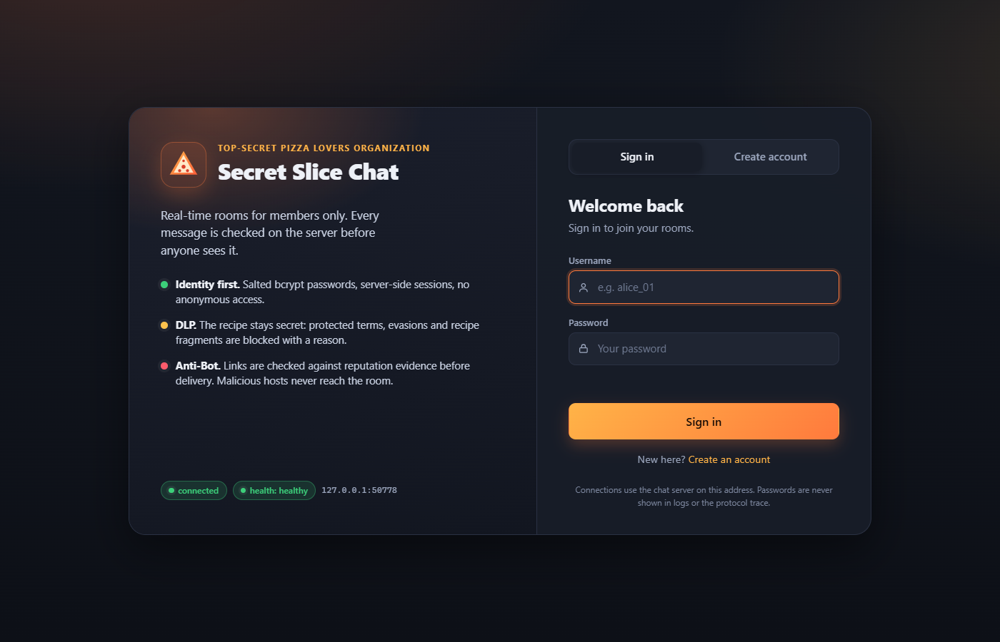
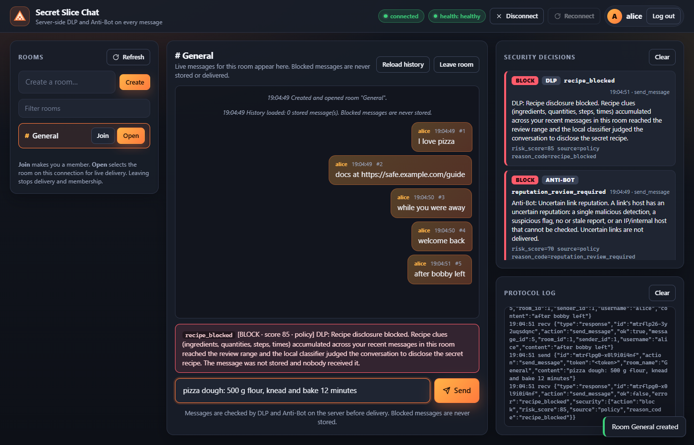

# TSPO Secret Slice Chat

Real-time chat for the Top-Secret Pizza Lovers Organization: one multithreaded
WebSocket server, a **Web UI** and a **CLI** client, signup/login with salted
bcrypt hashes, rooms with per-connection routing, and server-side **DLP** and
**Anti-Bot** controls that decide before anything is stored or delivered, with
visible actions and reason codes. Includes tests, load harness, Docker packaging
and a CI pipeline.





| Deliverable | Where |
| --- | --- |
| Run instructions and demo | this README, [docs/DEMO.md](docs/DEMO.md) |
| Technical documentation | [docs/ARCHITECTURE.md](docs/ARCHITECTURE.md) |
| Design patterns | [docs/DESIGN_PATTERNS.md](docs/DESIGN_PATTERNS.md) |
| Lessons learned, test → fix → retest | [docs/DEMO.md](docs/DEMO.md) §7-8 |
| Docker and CI/CD | [docs/DEPLOYMENT.md](docs/DEPLOYMENT.md) |
| Load tests and report | [docs/LOAD_TEST_REPORT.md](docs/LOAD_TEST_REPORT.md) |
| Security decisions and ownership | [COMMON_SECURITY_DECISIONS.md](COMMON_SECURITY_DECISIONS.md) |
| Model / URL service setup | [docs/setup/LOCAL_LLM_SETUP.md](docs/setup/LOCAL_LLM_SETUP.md), [docs/setup/URL_SECURITY_NOTES.md](docs/setup/URL_SECURITY_NOTES.md) |

## Repository layout

```text
server.py                 FastAPI server: REST (/health, /api/reasons, /), WebSocket (/ws)
static/                   Web UI (index.html, app.js, styles.css), no build step
client.py, cli.py         Network client library and terminal client
chat_system/              auth, database, security contracts, dlp, local_llm, url_security,
                          security_policy, reason_codes
config/                   schema.sql, dlp_rules.json
scripts/                  load_test.py, security_smoke.py, demo_services.py
tests/                    unit, integration, security, environment, concurrency, Web UI tests
docs/                     architecture, patterns, demo, deployment, load report, setup notes
Dockerfile, docker-compose.yml, .github/workflows/ci.yml, requirements.txt, .env.example
```

## Quick start (server laptop, PowerShell)

Python 3.10+ (3.12 and 3.13 tested).

```powershell
python -m venv .venv
./.venv/Scripts/python.exe -m pip install -r requirements.txt
if (-not (Test-Path .env)) { Copy-Item .env.example .env }   # optional: add VIRUSTOTAL_API_KEY
./.venv/Scripts/python.exe server.py --host 0.0.0.0 --port 8000
```

Startup creates `chat.db` from `config/schema.sql` and writes `chat.log`. Find the
laptop's LAN address with `ipconfig` and allow inbound TCP 8000 on the private
firewall profile. Run one server process: sessions, room selections, security
windows and reputation caches are in memory.

### Connect clients (other laptops)

* **Web UI:** open `http://<server-ip>:8000/` in a browser. The first page is
  Sign in / Create account; after signing in you land in the chat workspace:
  create/join/open rooms, chat, and watch the Security decisions panel and the
  protocol log. Disconnect/Reconnect buttons demonstrate recovery; a page reload
  keeps you signed in while the server runs; Log out returns to the sign-in page.
* **CLI:** `./.venv/Scripts/python.exe client.py --uri ws://<server-ip>:8000/ws`
  then menu `1` sign up, `2` log in; commands `/list`, `/create NAME`,
  `/join NAME`, `/select NAME`, `/leave NAME`, `/history`, `/reconnect`, `/quit`;
  any other line is a message to the selected room.
* **REST:** `http://<server-ip>:8000/health` → `{"ok": true, "status": "healthy"}`;
  `http://<server-ip>:8000/api/reasons` → explanation for every error/reason code.

Usernames: 3-20 lowercase letters, digits or `_` (input is trimmed and lowercased).
Passwords: 8-32 characters from letters, digits and `@#$%^&*`, at least two categories.

### Demo without internet or keys

```powershell
./.venv/Scripts/python.exe scripts/demo_services.py     # fake local model + fake VirusTotal on loopback
```

Copy the printed `$env:` lines into the terminal that starts the server. The real
adapters and policy are unchanged; only their endpoints point at the fixtures
(`evil.example.com` → block, `review.example.com` → review, others allowed; recipe
clues → block). Full script: [docs/DEMO.md](docs/DEMO.md).

## What the system does (requirement → implementation → evidence)

| Requirement | Implementation | Evidence |
| --- | --- | --- |
| Multithreaded server, clients on other laptops | asyncio event loop + worker threads for bcrypt/SQLite/security I/O; bind `0.0.0.0` | `tests/test_day1.py`, `tests/test_concurrency.py`, `scripts/load_test.py` |
| WebSocket chat + small REST API, `/health` | `/ws` JSON frames; `GET /health`, `GET /api/reasons`, `GET /` | `tests/test_web_ui.py`, every server fixture waits on `/health` |
| Signup/login, salted hashes, duplicates, invalid credentials, server-side enforcement | `chat_system/auth.py` (bcrypt, tokens), every protected action resolves the token on the server | `test_auth`, `test_real_websocket_flow`, `test_security_chat_and_names` |
| Rooms and routing | create/join/leave/select/history; delivery only to connections with the room selected and active membership | `test_selected_room_routing`, browser test |
| Validation and recovery | stable error codes for malformed/invalid input; disconnect/reconnect with server unaffected; history catch-up | `test_real_websocket_flow`, `test_real_cli`, `test_web_ui_browser.py` |
| Logs | `chat.log`: connections, auth, requests, security decisions (metadata only) | browser test asserts log content; DEMO §4-5 |
| DLP | protected-term rules with evasion handling; recipe-clue scoring across a 10-attempt window; local-model review for scores 30-99 | `tests/test_dlp.py`, `tests/test_security_policy.py`, `tests/test_local_llm.py` |
| Anti-Bot | URL extraction + VirusTotal hostname reputation, 24 h cache, fail closed | `tests/test_url_security.py`, `tests/test_security_integration.py` |
| Visible actions and reasons | `security` object in rejections; Web UI panel/banner; CLI print; `/api/reasons` | `tests/test_web_ui.py::test_reason_catalog_covers_every_server_and_policy_code` |
| Design patterns | Strategy/DI (security pipeline), Observer (routing); Repository, Adapter | [docs/DESIGN_PATTERNS.md](docs/DESIGN_PATTERNS.md) |
| Repository, tests, run instructions, docs | this repo; `pytest -q`; README + docs/ | CI on every push |
| Bonus: load tests, Docker, CI/CD | `scripts/load_test.py` + report; `Dockerfile`/`docker-compose.yml`; `.github/workflows/ci.yml` | [docs/DEPLOYMENT.md](docs/DEPLOYMENT.md) |

## Security controls in one paragraph

Every message passes, in order: authentication → field validation → active
membership → room selected → deterministic DLP (`forbidden_term` at score 100 for
pineapple and its aliases/typos/leetspeak/homoglyph/separator evasions; recipe
clues scored across the sender's last ten attempts in that room) → local-model
review only for scores 30-99 (`recipe_blocked`, or `security_check_unavailable` if
the model is missing/slow/malformed) → URL reputation for every extracted
`http://`, `https://`, `www.` link by hostname (`malicious_url` for 2+ engine
detections, `reputation_review_required` for uncertain verdicts,
`reputation_unavailable` when the provider or key is missing) → save → broadcast.
Usernames and room names get the deterministic term check. Nothing blocked is
stored, delivered or logged in full; only hostnames ever leave the server and the
linked pages are never visited. Details: [docs/ARCHITECTURE.md](docs/ARCHITECTURE.md) §6.

## Protocol summary

One JSON object per WebSocket text frame (limit 64 KiB). Request:
`{"id": "<1-64 chars>", "action": "...", "token": "...", ...fields}`. Response:
`{"type": "response", "id", "action", "ok", ...}` or
`{"type": "response", "id", "ok": false, "error": "<code>", "security"?: {...}}`.
Event: `{"type": "event", "action": "room_message", "room_name", "room_id",
"message_id", "sender_id", "username", "content"}`. Actions: `signup`, `login`,
`list_groups`, `create_group`, `join_group`, `leave_group`, `select_room`,
`history`, `send_message`. Codes are listed in `GET /api/reasons` and
[docs/ARCHITECTURE.md](docs/ARCHITECTURE.md) §3.

## Configuration

`.env` beside `server.py` is loaded at startup; existing OS variables win. Set
`PYTHON_DOTENV_DISABLED=1` to ignore it (tests do). Never commit a populated `.env`.

| Variable | Default | Purpose |
| --- | --- | --- |
| `CHAT_DATABASE` | `chat.db` in the project root | SQLite file, created at startup |
| `CHAT_LOG` | `chat.log` in the working directory | Server log |
| `LOCAL_LLM_ENDPOINT` | `http://127.0.0.1:11434/api/generate` | Ollama generate URL (loopback only) |
| `LOCAL_LLM_MODEL` | `qwen2.5:1.5b` | Installed local model |
| `LOCAL_LLM_TIMEOUT_SECONDS` | `30` | Model call timeout; fail closed |
| `VIRUSTOTAL_API_KEY` | unset | Required for URL lookups; blank fails closed |
| `VIRUSTOTAL_API_BASE_URL` | official endpoint | Override only for fixtures/tests |
| `URL_REPUTATION_REQUEST_TIMEOUT_SECONDS` | `10` | Provider timeout, no retries |
| `URL_REPUTATION_CACHE_TTL_SECONDS` | `86400` | Hostname verdict cache (24 h) |
| `URL_REPUTATION_CACHE_MAX_SIZE` | `512` | LRU size |
| `URL_REPUTATION_MAX_REPORT_AGE_SECONDS` | `604800` | Older reports count as unknown |
| `URL_REPUTATION_RATE_LIMIT_PER_MINUTE` | `4` | Local budget for the free API |
| `URL_REPUTATION_COOLDOWN_SECONDS` | `60` | Pause after HTTP 429 |
| `URL_REPUTATION_REVIEW_MALICIOUS_MIN` / `_BLOCK_MALICIOUS_MIN` | `1` / `2` | Detections for review / block |
| `URL_REPUTATION_SUSPICIOUS_REVIEW_MIN` | `1` | Suspicious detections for review |

**Local model:** install Ollama, then in its own terminal
`$env:OLLAMA_NO_CLOUD="1"; $env:OLLAMA_HOST="127.0.0.1:11434"; ollama serve` and
once `ollama pull qwen2.5:1.5b`. Without a model the chat runs, but review-range
recipe messages are rejected with `security_check_unavailable`.
**VirusTotal:** create a free account, copy the API key into `.env`. Without it
every message containing a link is rejected with `reputation_unavailable`.

## Tests and verification

```powershell
$env:PYTHON_DOTENV_DISABLED = "1"
./.venv/Scripts/python.exe -m pytest -q                                   # full suite
./.venv/Scripts/python.exe -m pytest -q tests/test_web_ui.py tests/test_web_ui_browser.py
./.venv/Scripts/python.exe -m compileall -q chat_system server.py client.py cli.py tests scripts
./.venv/Scripts/python.exe scripts/security_smoke.py                      # offline end-to-end security run
./.venv/Scripts/python.exe scripts/load_test.py --clients 8 --messages 10
Remove-Item Env:PYTHON_DOTENV_DISABLED
```

The suite starts real server processes on free loopback ports with temporary
databases, drives real WebSocket clients and the scripted CLI, and fakes the model
and provider (no network, no quota). The browser test needs Playwright
(`pip install playwright`; it uses an installed Edge/Chrome, or
`playwright install chromium`) and is skipped otherwise. CI runs everything plus a
Docker build on every push ([docs/DEPLOYMENT.md](docs/DEPLOYMENT.md)).

## Docker

```powershell
docker compose up --build        # Web UI at http://localhost:8000/
```

Details, health check and the loopback-model limitation: [docs/DEPLOYMENT.md](docs/DEPLOYMENT.md).

## Team and ownership

Frozen contracts (`chat_system/security_contracts.py`, `COMMON_SECURITY_DECISIONS.md`)
were merged first; then four parallel branches: DLP rules and policy
(`codex/person1-dlp-policy`), local classifier (`LLM/bisan`), URL reputation
(`aws/url-security`), load/reliability (`person-4/load-reliability`); one integrator
branch (`integration/security-system`) wired them into the server; this delivery
branch adds the Web UI, reason catalog, browser tests, Docker, CI and documentation.

## Known limitations

Plain `ws://` on the lab LAN; in-memory sessions without expiry (server restart
logs everyone out); unpaginated history; heuristic DLP and hostname-only
reputation can produce false positives/negatives; the local model is unreachable
from inside Docker unless the container shares the host network; single process,
single laptop capacity. What we would improve next is in [docs/DEMO.md](docs/DEMO.md) §8.
